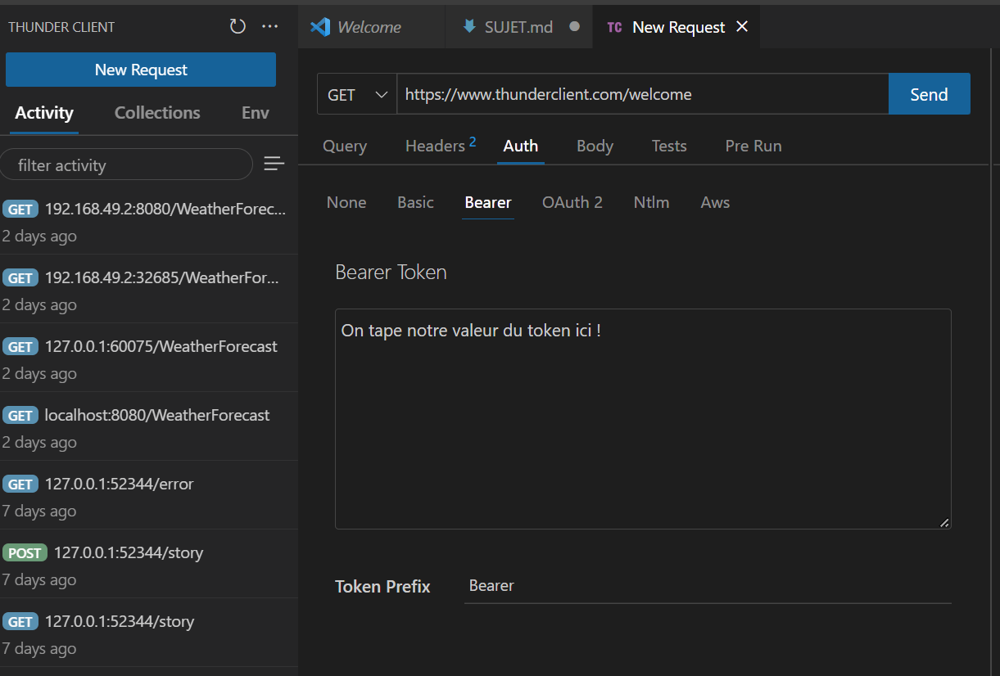

# Exercice Final Kubernetes

### Objectif

Via le [projet](./project.zip) d'une application, faire en sorte de rendre disponible sur une cluster Kubernetes trois applications de type API réalisées en **Node.js**.

---

### Le Projet

Notre projet consiste en trois API réalisées avec Node.js. Ce projet consiste en trois API qui doivent communiquer entre elles pour fonctionner correctement. Dans le cadre du test de notre projet, il est possible d'avoir recourt à l'utilisation du fichier `docker-compose.yml` fourni à la racine du projet. Pour le lancer, il suffit d'effectuer la commande ci-dessous après avoir ouvert un terminal à l'emplacement de la racine du projet: 

```bash
docker compose up -d
```

Cette commande va rendre disponible notre projet, qui, d'un point de vue extérieur, rend disponible deux API. Ces API peuvent être intérrogées via leurs endpoints, qui doivent être interpelés via l'utilisation d'un client REST de type **Postman** ou **Thunder Client**.

---

### Comment fonctionne le projet ?

Pour pouvoir tester les endpoints (les chemins à attaquer via le client RESt), il est nécessaire, dans notre cas, de faire des appels REST de type POST tel que: 

* Pour tester l'utilisation de l'API concernant les utilisateurs, on peut faire un POST à l'endpoint http://localhost:8080/signup ou http://localhost:8080/login. La requête doit comperter un Bearer Token ayant pour valeur `abc` et porter comme corps un JSON de ce type: 

```json
{
  "email": "test@example.com",
  "password": "password"
}
```

Dans le cas où l'API fonctionne, on aura une réponse ayant pour code de statut un **2xx** une réponse sous la forme d'un JSON, confirmant le bon fonctionnement de l'API. 

* Pour tester l'API des tâches, il nous faut via le client REST, réaliser un POST vers http://localhost:8000/tasks avec un Bearer token ayant pour valeur `abc` et comme corps de la requête un JSON ayant pour structure: 

```json
{
  "text": "Valeur de text",
  "title": "Valeur de title"
}
```

Le bonfonctionnement de l'API sera confirmé par un code de status **2xx** et une réponse sous la forme d'un JSON comme pour l'API précédente.

Les API doivent intérroger de leur côté la troisième API, celle d'authentification, dans le but de vérifier la valeur du token d'authentification. Pour ce faire, il est nécessaire que la variable d'environnement `AUTH_ADDRESS` présente dans l'API des utilisateurs et celle des tâches soit alimentée et contienne un nom d'hôte reliant à l'adresse IP de l'API d'authentification. De plus, pour l'API des tâches, le stockage des tâches se fait dans un dossier qui porte un nom géré par la variable d'environnement `TASK_FOLDER`, qu'il est donc nécessaire d'alimenter également. 

---

### Votre mission

Dans un premier temps, il vous faudra créer un repository Git permettant de pouvoir, au fur et à mesure de votre travail, le partager avec le reste de l'équipe. Ce repository contiendra un fichier `.md` pour offrir une présentation plus intéressante qu'un fichier texte classique. 

Dans le cadre de l'exercice, il est nécessaire de mettre en place les éléments Kubernetes appris en cours permettant le fonctionnement du projet dans le cadre d'un cluster mono-nodal et d'informer par la suite le reste de l'équipe des étapes à suivre pour la réalisation de cet objectif (lignes de commandes, instructions verbeuses pour plus de détail, images au besoin, etc...).

---

### Comment mettre en place un Bearer Token sur Thunder Client

Dans Thunder Client (**CTRL + SHIFT + R**), il est nécessaire, après avoir créé une nouvelle requête, de naviguer dans les onglets sous la requête et de sélectionner **Auth**, puis dans les onglets nouvellement disponible **Bearer**. Il ne reste plus qu'à taper la valeur du token (`abc` dans notre cas) dans la boite de dialogue disponible.

